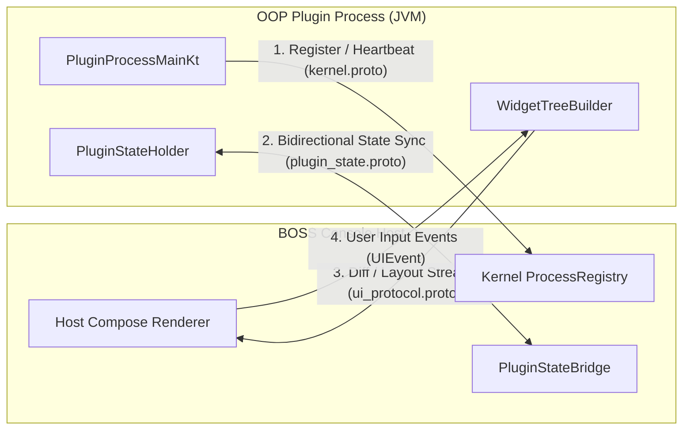
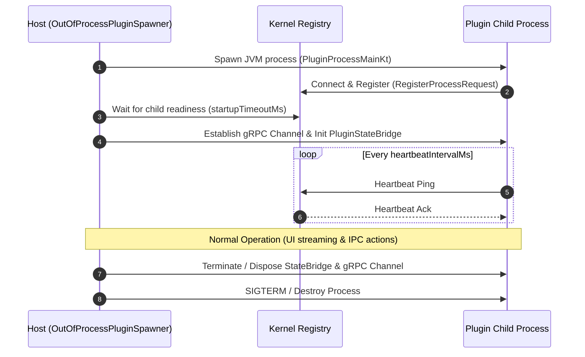

# Out-of-Process (OOP) Plugin & IPC Architecture Guide

This guide documents the architecture, lifecycle, IPC protocols, and step-by-step development workflow for building and running **Out-of-Process (OOP)** plugins within BOSS Console.

---

## 1. Overview & Architectural Motivation

BOSS Console supports two execution models for plugins:

| Feature | In-Process Plugins | Out-of-Process (OOP) Plugins |
|---|---|---|
| **Runtime Boundary** | Host JVM (Classloader isolation) | Dedicated Child JVM process |
| **Crash Resilience** | Crash / OOM can destabilize host | Process isolation: Child failure does not crash the host |
| **UI Rendering** | Direct Compose Multiplatform composables | Remote Widget Tree streaming via `boss-ui-sdk` over gRPC |
| **Classpath Separation** | Potential dependency conflicts with host | Fully isolated dependency tree and JVM arguments |
| **Security / Sandbox** | Shares host memory address space | Restricted capabilities governed by IPC permission boundaries |

### Microkernel Host Components
- **`boss-ipc`**: Core Protocol Buffer definitions (`boss.ipc.v1`) and gRPC channel abstraction layer.
- **`boss-process-manager`**: Manages process lifecycle (`ProcessSpawner`, `ProcessRegistry`, restart policies).
- **`boss-orchestrator`**: Orchestrates service discovery, capability routing, and IPC event dispatching.
- **`boss-ui-sdk`**: Provides the remote widget tree declarative DSL, diff engine (`WidgetDiffEngine`), proto converters, and event mappings for headless child processes.
- **`OutOfProcessPluginSpawnerImpl`**: Host-side component responsible for launching, monitoring, handshaking, and tearing down plugin child processes.

---

## 2. IPC Protocol & Communication Model

OOP plugins communicate with the BOSS Console host over local gRPC transport using Protocol Buffers defined in `:modules:boss-ipc` under `boss.ipc.v1`.



### Core IPC Services (`boss.ipc.v1`)

1. **`KernelService` (`kernel.proto`)**:
   - Handles process registration handshake (`RegisterProcessRequest`).
   - Heartbeat / liveness polling (`HeartbeatPing` / `HeartbeatPong`).
   - Process state telemetry reporting.

2. **`PluginStateService` (`plugin_state.proto`)**:
   - Bidirectional state streaming between host `PluginStateBridge` and plugin `PluginStateHolder`.
   - Snapshot serialization and state delta updates.

3. **`UIProtocolService` (`ui_protocol.proto`)**:
   - Streams virtual widget trees and incremental patches (`WidgetPatch`, `WidgetDiffEngine`).
   - Routes user interactions (clicks, text input, scroll events) back to the plugin process.

4. **`EventBusService` (`event_bus.proto`)**:
   - Enables publish-subscribe messaging across plugins and host subsystems.

### Versioning & Compatibility Handshake
The host enforces strict IPC versioning via `IpcVersion`. When spawning a plugin process:
- Host verifies `minIpcVersion` declared by the runtime JAR.
- Incompatible runtime JARs are rejected before process startup to prevent runtime serialization mismatches.

---

## 3. Plugin Lifecycle & Host Interaction



### Lifecycle Stages
1. **Spawn**: `OutOfProcessPluginSpawnerImpl.spawn()` builds the classpath (`runtimeClasspath` + `pluginJar` + `apiJar`), prepares the `ProcessConfig`, and executes the child process via `ProcessSpawner`.
2. **Registration Handshake**: The child connects back to the kernel via `BOSS_KERNEL_IPC_ADDR` and registers its process ID and IPC listening address.
3. **Readiness Gate**: Host awaits child registration up to `startupTimeoutMs` (default: 30s). If timeout expires, `cleanupFailedSpawn` forcibly kills the orphaned child.
4. **Heartbeat & Monitoring**: Periodic heartbeats (`heartbeatIntervalMs`, default: 5s) maintain active status. Missed heartbeats trigger restart policies (`RestartPolicy.ON_FAILURE`, `maxRestartAttempts`).
5. **Teardown**: Host shuts down gRPC channels gracefully (with 3-second fallback to `shutdownNow`), disposes state bridges, and terminates the child process.

---

## 4. Building an OOP Plugin (Step-by-Step)

### Step 1: Plugin Manifest (`plugin.json`)

Declare `"isolationMode": "out-of-process"` in your plugin's `plugin.json`:

```json
{
  "manifestVersion": 1,
  "pluginId": "sample-oop-plugin",
  "displayName": "Sample OOP Plugin",
  "version": "1.0.0",
  "apiVersion": "1.0.0",
  "mainClass": "ai.rever.boss.plugin.sample.SamplePlugin",
  "type": "panel",
  "description": "Demonstrates out-of-process plugin capabilities",

  "isolationMode": "out-of-process",
  "fallback": "in-process",
  "stateHolderClass": "ai.rever.boss.plugin.sample.SampleStateHolder",

  "sandbox": {
    "maxThreads": 4,
    "maxRestartAttempts": 3,
    "heartbeatIntervalMs": 5000
  },

  "healthContract": {
    "heartbeatIntervalMs": 5000,
    "startupTimeoutMs": 30000
  },

  "panel": {
    "defaultSlot": "left.top.bottom",
    "iconName": "extension"
  },

  "isDynamic": true,
  "canUnload": true,
  "loadPriority": 100
}
```

### Step 2: Build Configuration (`build.gradle.kts`)

OOP plugins are packaged as fat shadow JARs containing the plugin code and its private dependencies, while referencing API and runtime interfaces provided by the host runtime:

```kotlin
plugins {
    alias(libs.plugins.kotlinJvm)
    alias(libs.plugins.kotlinSerialization)
    id("com.github.johnrengelman.shadow") version "8.1.1"
}

dependencies {
    // Plugin API (Provided at runtime by boss-microkernel-runtime - do not bundle)
    compileOnly(project(":plugin-platform:plugin-api-core"))
    compileOnly(project(":boss-microkernel-runtime"))
    compileOnly(project(":modules:boss-ui-sdk"))
    compileOnly(project(":modules:boss-ipc"))

    // Plugin-specific dependencies
    implementation(libs.kotlinx.coroutines.core)
    implementation(libs.kotlinx.serialization.json)
}

tasks.shadowJar {
    archiveClassifier.set("all")
    mergeServiceFiles()

    manifest {
        attributes["Main-Class"] = "ai.rever.boss.plugin.runtime.PluginProcessMainKt"
    }

    // Exclude runtime and api jars already provided by host environment
    dependencies {
        exclude(dependency("ai.rever.boss.plugin:plugin-api-core"))
        exclude(dependency("ai.rever.boss.microkernel.runtime:boss-microkernel-runtime"))
    }
}
```

### Step 3: Implementing State & Remote UI (`WidgetTreeBuilder`)

Out-of-process plugins construct remote UI trees using the declarative DSL in `boss-ui-sdk`:

```kotlin
package ai.rever.boss.plugin.sample

import ai.rever.boss.ui.sdk.WidgetTreeBuilder
import ai.rever.boss.ui.sdk.WidgetEvent
import kotlinx.coroutines.flow.MutableStateFlow
import kotlinx.coroutines.flow.StateFlow

class SampleStateHolder {
    private val _counter = MutableStateFlow(0)
    val counter: StateFlow<Int> = _counter

    fun increment() {
        _counter.value++
    }

    fun handleEvent(event: WidgetEvent) {
        when (event.actionId) {
            "btn_increment" -> increment()
        }
    }

    fun renderUI(): WidgetTreeBuilder.Node {
        return WidgetTreeBuilder.column {
            text("Counter: ${_counter.value}")
            button(
                id = "btn_increment",
                label = "Increment Counter"
            )
        }
    }
}
```

The `WidgetDiffEngine` automatically calculates minimal deltas (`WidgetPatch`) between UI emissions and transmits them over gRPC to the host Compose Multiplatform renderer.

---

## 5. Security & Permission Boundaries

1. **Process Isolation**: The child process runs with dedicated memory spaces, preventing memory leaks, unhandled exceptions, or native crashes from taking down the main BOSS Console application.
2. **Access-Controlled Host Services**: OOP plugins cannot access host singletons or local databases directly. All interactions with host services (Filesystem, Secret Vault, Terminal, Auth) are mediated through IPC services and verified against the user's active RBAC roles.
3. **Environment Isolation**: Plugin processes receive explicit environment variables (`BOSS_KERNEL_IPC_ADDR`, `BOSS_PLUGIN_ID`, `BOSS_PROJECT_PATH`) without leaking sensitive host session tokens.

---

## 6. Debugging & Local Testing

### Standalone Process Execution
To debug an OOP plugin process independently:
1. Launch BOSS Console with debug logging enabled (`-Dlogback.configurationFile=logback-debug.xml`).
2. Run the plugin process with standard JVM debugging arguments:
   ```bash
   java -agentlib:jdwp=transport=dt_socket,server=y,suspend=n,address=5005 \
        -cp "runtime.jar;plugin.jar" \
        ai.rever.boss.plugin.runtime.PluginProcessMainKt
   ```
3. Pass `BOSS_KERNEL_IPC_ADDR=localhost:<port>` and `BOSS_PLUGIN_ID=<id>` as environment variables.

### Unit Testing Remote Widgets
Use `WidgetDiffEngine` directly in unit tests to assert UI tree generation without spinning up a full gRPC server:

```kotlin
@Test
fun testWidgetTreeGeneration() {
    val stateHolder = SampleStateHolder()
    val initialTree = stateHolder.renderUI()
    
    stateHolder.increment()
    val updatedTree = stateHolder.renderUI()
    
    val patches = WidgetDiffEngine.computeDiff(initialTree, updatedTree)
    assertTrue(patches.isNotEmpty())
}
```
