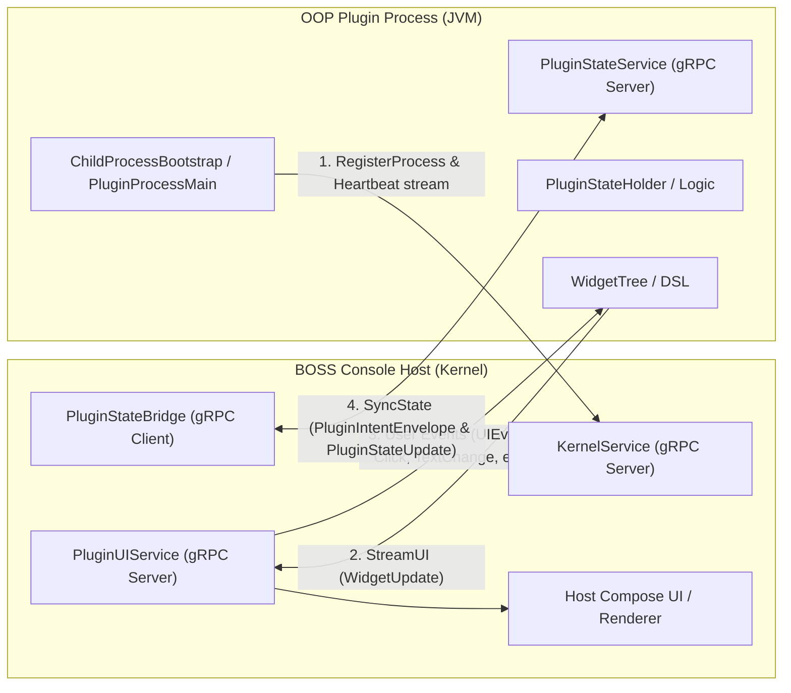
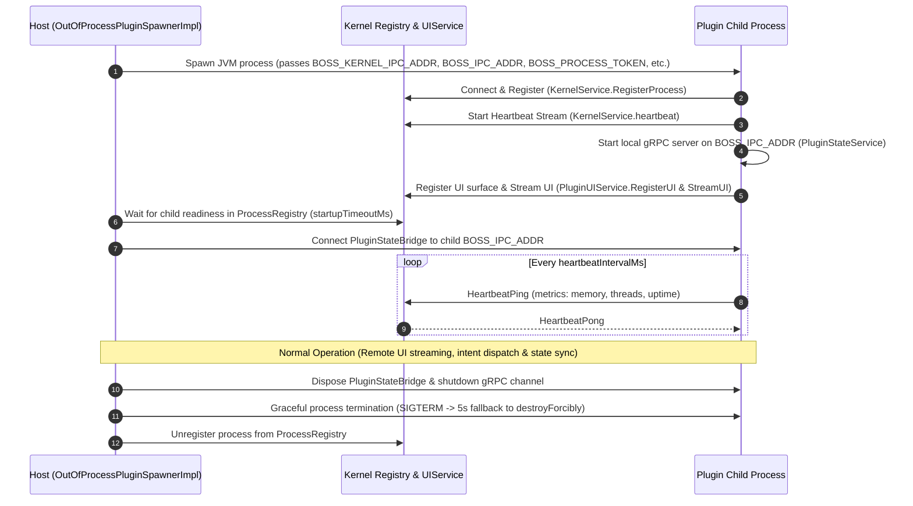

# Out-of-Process (OOP) Plugin & IPC Architecture Guide

This guide documents the architecture, lifecycle, IPC protocols, and step-by-step development workflow for building and running **Out-of-Process (OOP)** plugins within BOSS Console.

---

## 1. Overview & Architectural Motivation

BOSS Console supports two execution models for plugins:

| Feature | In-Process Plugins | Out-of-Process (OOP) Plugins |
|---|---|---|
| **Runtime Boundary** | Host JVM (Classloader isolation) | Dedicated Child JVM process |
| **Crash Resilience** | Crash / OOM can destabilize host | Process isolation: Child failure does not crash the host |
| **UI Rendering** | Direct Compose Multiplatform composables | Remote Widget Tree streaming via `boss-ui-sdk` over gRPC |
| **Classpath Separation** | Potential dependency conflicts with host | Fully isolated dependency tree and JVM arguments |
| **Security / Sandbox** | Shares host memory address space | Restricted capabilities governed by IPC permission boundaries |

### Microkernel Host & IPC Modules
- **`:boss-ipc`**: Core Protocol Buffer definitions (`boss.ipc.v1`), gRPC channel/server abstraction layer (`BossIpcClient`, `BossIpcServer`), child process bootstrapper (`ChildProcessBootstrap`), and process authentication interceptors.
- **`:boss-process-manager`**: Manages process lifecycle (`ProcessSpawner`, `ProcessRegistry`, restart policies, health checks).
- **`:boss-orchestrator`**: Orchestrates service discovery, capability routing, and IPC event dispatching.
- **`:boss-ui-sdk`**: Declarative remote widget tree DSL (`widgetTree`), diff engine (`WidgetDiffEngine`), protobuf converters (`WidgetProtoConverter`), and event mappings (`UIEventMapper`, `WidgetEvent`).
- **`OutOfProcessPluginSpawnerImpl`**: Host-side component responsible for launching, monitoring, handshaking, and tearing down plugin child processes.
- **`PluginUIServiceBridge`**: Kernel-side service implementing `PluginUIService` that receives streamed virtual widget trees and routes Compose user interactions back to child processes.
- **`boss-microkernel-runtime`**: Upstream standalone runtime JAR containing plugin state runners and dispatchers.

---

## 2. IPC Protocol & Communication Model

OOP plugins communicate with the BOSS Console host over local gRPC transport using Protocol Buffers defined in `:boss-ipc` under package `boss.ipc.v1` (Java package `ai.rever.boss.ipc.proto`).



### Core IPC Services (`boss.ipc.v1`)

1. **`KernelService` (`kernel.proto`)** *(Hosted by Kernel)*:
   - Process registration handshake (`RegisterProcessRequest` / `RegisterProcessResponse`).
   - Liveness heartbeat polling stream (`HeartbeatPing` / `HeartbeatPong`).
   - Service address directory discovery.

2. **`PluginUIService` (`ui_protocol.proto`)** *(Hosted by Kernel)*:
   - The plugin process acts as the gRPC **client**, dialing the Kernel's `PluginUIService`.
   - Plugin calls `RegisterUI` with initial `WidgetTree` layout and metadata.
   - Plugin opens bidirectional `StreamUI` call: streams `WidgetUpdate` (full tree or incremental `WidgetPatch`) to Kernel, and reads incoming `UIEvent` (clicks, text input, checkbox toggles, keystrokes) streamed from Kernel Compose UI.

3. **`PluginStateService` (`plugin_state.proto`)** *(Hosted by Child Plugin Process)*:
   - Child process runs local `BossIpcServer` on `BOSS_IPC_ADDR`.
   - Host `PluginStateBridge` connects as client.
   - Supports bidirectional `SyncState` (host sends `PluginIntentEnvelope`, child sends `PluginStateUpdate` with snapshots or JSON Merge Patch deltas `PluginStateDelta`).
   - Supports `GetCurrentState` for reconnection recovery.

4. **`EventBusService` (`event_bus.proto`)**:
   - Enables publish-subscribe messaging across plugins and host subsystems.

### Versioning & Compatibility Handshake
The host enforces strict IPC versioning via `IpcVersion`. When spawning a plugin process:
- Host verifies `minIpcVersion` declared by the runtime JAR.
- Incompatible runtime JARs are rejected before process startup to prevent runtime serialization mismatches.

---

## 3. Plugin Lifecycle & Host Interaction



### Lifecycle Stages
1. **Spawn**: `OutOfProcessPluginSpawnerImpl.spawn()` builds the classpath (`runtimeClasspath` + `jarPath` + `boss.api.jar`), sets JVM flags (`-Xmx512m`, `-Xms64m`, `-Dboss.api.version`), passes environment variables, and launches via `ProcessSpawner`.
2. **Registration Handshake**: `ChildProcessBootstrap` in the child connects to `BOSS_KERNEL_IPC_ADDR` with `BOSS_PROCESS_TOKEN` authentication metadata, registers process ID and IPC listening address via `KernelService.RegisterProcess`.
3. **Heartbeat & Monitoring**: Periodic heartbeats (`heartbeatIntervalMs`, default: 5s) stream CPU/memory/thread metrics. Missed heartbeats trigger restart policies (`RestartPolicy.ON_FAILURE`, `maxRestartAttempts`).
4. **UI & State Binding**: Plugin registers its UI surface on Kernel `PluginUIService` and starts streaming widgets. Host connects `PluginStateBridge` to the child's `PluginStateService` on `BOSS_IPC_ADDR`.
5. **Teardown**: Host shuts down state bridge, closes gRPC channels (graceful 3-second wait, then `shutdownNow`), signals child termination (5-second graceful exit before `destroyForcibly`), and unregisters from `ProcessRegistry`.

---

## 4. Building an OOP Plugin (Step-by-Step)

### Step 1: Plugin Manifest (`plugin.json`)

Declare `"isolationMode": "out-of-process"` in your plugin's `plugin.json`:

```json
{
  "manifestVersion": 1,
  "pluginId": "sample-oop-plugin",
  "displayName": "Sample OOP Plugin",
  "version": "1.0.0",
  "apiVersion": "1.0.0",
  "mainClass": "ai.rever.boss.plugin.sample.SamplePlugin",
  "type": "panel",
  "description": "Demonstrates out-of-process plugin capabilities",

  "isolationMode": "out-of-process",
  "fallback": "in-process",
  "stateHolderClass": "ai.rever.boss.plugin.sample.SampleStateHolder",

  "sandbox": {
    "maxThreads": 4,
    "maxRestartAttempts": 3,
    "heartbeatIntervalMs": 5000
  },

  "healthContract": {
    "heartbeatIntervalMs": 5000,
    "startupTimeoutMs": 30000
  },

  "panel": {
    "defaultSlot": "left.top.bottom",
    "iconName": "extension"
  },

  "isDynamic": true,
  "canUnload": true,
  "loadPriority": 100
}
```

### Step 2: Build Configuration (`build.gradle.kts`)

OOP plugins are packaged as fat shadow JARs containing the plugin code and its private dependencies, while referencing API and IPC interfaces provided by the host environment:

```kotlin
plugins {
    alias(libs.plugins.kotlinJvm)
    alias(libs.plugins.kotlinSerialization)
    id("com.github.johnrengelman.shadow") version "8.1.1"
}

group = "ai.rever.boss.plugin.sample"
version = "1.0.0"

java {
    toolchain {
        languageVersion.set(JavaLanguageVersion.of(17))
    }
}

dependencies {
    // Plugin API and IPC definitions (provided at runtime by host - do not bundle)
    compileOnly(project(":plugin-platform:plugin-api-core"))
    compileOnly(project(":boss-ipc"))
    compileOnly(project(":boss-ui-sdk"))

    // Plugin-specific dependencies
    implementation(libs.kotlinx.coroutines.core)
    implementation(libs.kotlinx.serialization.json)
}

tasks.shadowJar {
    archiveClassifier.set("all")
    mergeServiceFiles()

    manifest {
        attributes["Main-Class"] = "ai.rever.boss.plugin.runtime.PluginProcessMainKt"
    }

    // Exclude API and host runtime modules already provided by the host environment
    dependencies {
        exclude(dependency("ai.rever.boss.plugin:plugin-api-core"))
        exclude(dependency("ai.rever.boss:boss-ipc"))
        exclude(dependency("ai.rever.boss:boss-ui-sdk"))
        exclude(dependency("ai.rever.boss.microkernel.runtime:boss-microkernel-runtime"))
    }
}
```

> **Note on Gradle Module Paths**: When building inside the BOSS Console repository, microkernel modules live in `modules/` but use flat Gradle project paths: `:boss-ipc` and `:boss-ui-sdk` (not `:modules:boss-ipc`).

### Step 3: Implementing State & Remote UI (`boss-ui-sdk`)

Out-of-process plugins construct remote UI trees using the declarative `widgetTree` DSL in `boss-ui-sdk`:

```kotlin
package ai.rever.boss.plugin.sample

import ai.rever.boss.ui.sdk.WidgetEvent
import ai.rever.boss.ui.sdk.WidgetTree
import ai.rever.boss.ui.sdk.widgetTree
import kotlinx.coroutines.flow.MutableStateFlow
import kotlinx.coroutines.flow.StateFlow
import kotlinx.coroutines.flow.asStateFlow
import kotlinx.serialization.Serializable

@Serializable
data class SampleUiState(
    val counter: Int = 0,
    val statusText: String = "Ready"
)

class SampleStateHolder {
    private val _state = MutableStateFlow(SampleUiState())
    val state: StateFlow<SampleUiState> = _state.asStateFlow()

    fun increment() {
        val current = _state.value
        _state.value = current.copy(
            counter = current.counter + 1,
            statusText = "Incremented at ${System.currentTimeMillis()}"
        )
    }

    fun handleEvent(event: WidgetEvent) {
        when (event) {
            is WidgetEvent.Click -> {
                when (event.eventId) {
                    "btn_increment" -> increment()
                }
            }
            is WidgetEvent.TextChange -> {
                _state.value = _state.value.copy(statusText = event.newValue)
            }
            is WidgetEvent.Toggle -> {
                // Handle switch/checkbox toggles
            }
            is WidgetEvent.Selection -> {
                // Handle dropdown selections (event.value, event.index)
            }
            else -> Unit
        }
    }

    fun renderUI(): WidgetTree {
        val current = _state.value
        return widgetTree {
            column {
                text(value = "Counter: ${current.counter}")
                text(value = "Status: ${current.statusText}")
                button(
                    label = "Increment Counter",
                    onClickEvent = "btn_increment"
                )
            }
        }
    }
}
```

The `WidgetDiffEngine` automatically calculates minimal deltas (`DiffOperation`) between consecutive `WidgetTree` emissions and transmits them over gRPC to the host Compose Multiplatform renderer.

---

## 5. Security & Permission Boundaries

1. **Process Isolation**: The child process runs with dedicated memory spaces, preventing memory leaks, unhandled exceptions, or native crashes from taking down the main BOSS Console application.
2. **IPC Token Authentication**: Host kernel issues a cryptographic `BOSS_PROCESS_TOKEN` per spawned process. The child passes this token on all gRPC calls via `ProcessTokenClientInterceptor`, which the Kernel verifies using `ProcessIdentityInterceptor`.
3. **Access-Controlled Host Services**: OOP plugins cannot access host singletons or local databases directly. All interactions with host services (Filesystem, Secret Vault, Terminal, Auth) are mediated through IPC services and verified against the user's active RBAC roles.
4. **Environment Isolation**: Plugin processes receive explicit environment variables (`BOSS_KERNEL_IPC_ADDR`, `BOSS_PROCESS_ID`, `BOSS_PROCESS_TYPE`, `BOSS_IPC_ADDR`, `BOSS_PLUGIN_CLASSPATH`, `BOSS_PROJECT_PATH`, `BOSS_WINDOW_ID`) without leaking host session secrets or credentials.

---

## 6. Debugging & Local Testing

### Required Launch Parameters & Environment Variables

When running or debugging an OOP plugin process (either spawned by host or executed independently):

| Variable / Parameter | Type | Description |
|---|---|---|
| `BOSS_PROCESS_ID` | Env Var | Unique identifier for the process (e.g. `plugin-sample-oop-plugin`) |
| `BOSS_PROCESS_TYPE` | Env Var | Process type enum (`PLUGIN` or `SERVICE`) |
| `BOSS_KERNEL_IPC_ADDR` | Env Var | Host kernel gRPC listening address (e.g. `localhost:50051` or domain socket) |
| `BOSS_IPC_ADDR` | Env Var | Child process's own gRPC server bind address (e.g. `localhost:50052`) |
| `BOSS_PLUGIN_CLASSPATH` | Env Var | Path to the plugin's fat shadow JAR |
| `BOSS_PROCESS_TOKEN` | Env Var | IPC security token (optional in standalone test mode; required in production host) |
| `BOSS_PROJECT_PATH` | Env Var | Active project root directory |
| `BOSS_WINDOW_ID` | Env Var | ID of the host window hosting the panel/tab |
| `-Dboss.api.version` | JVM Arg | Target API version (e.g. `-Dboss.api.version=1.0.0`) |
| `-Xmx512m -Xms64m` | JVM Arg | Process heap allocation bounds |

### Standalone Process Execution Example

To debug an OOP plugin process independently in an IDE or terminal:

```bash
# Set required environment variables
export BOSS_PROCESS_ID="plugin-sample-oop-plugin"
export BOSS_PROCESS_TYPE="PLUGIN"
export BOSS_KERNEL_IPC_ADDR="localhost:50051"
export BOSS_IPC_ADDR="localhost:50052"
export BOSS_PLUGIN_CLASSPATH="/path/to/sample-oop-plugin-all.jar"

# Launch JVM with JDWP debugging enabled
java -agentlib:jdwp=transport=dt_socket,server=y,suspend=n,address=5005 \
     -Dboss.api.version=1.0.0 \
     -Xms64m -Xmx512m \
     -cp "boss-microkernel-runtime-all.jar:sample-oop-plugin-all.jar" \
     ai.rever.boss.plugin.runtime.PluginProcessMainKt
```

### Unit Testing Remote Widgets & Diff Engine

Use `WidgetDiffEngine` directly in unit tests to assert UI tree generation and diff delta calculations without spinning up a gRPC server:

```kotlin
package ai.rever.boss.plugin.sample

import ai.rever.boss.ui.sdk.DiffOperation
import ai.rever.boss.ui.sdk.WidgetDiffEngine
import ai.rever.boss.ui.sdk.WidgetEvent
import ai.rever.boss.ui.sdk.WidgetType
import kotlin.test.Test
import kotlin.test.assertEquals
import kotlin.test.assertTrue

class SampleStateHolderTest {
    @Test
    fun testWidgetTreeGenerationAndDiff() {
        val stateHolder = SampleStateHolder()
        val initialTree = stateHolder.renderUI()
        
        assertEquals(3, initialTree.nodes.size) // column + 2 text nodes + button = 4 total
        val root = initialTree.nodes[initialTree.rootId]!!
        assertEquals(WidgetType.COLUMN, root.type)

        // Trigger action via WidgetEvent
        stateHolder.handleEvent(WidgetEvent.Click(eventId = "btn_increment"))
        val updatedTree = stateHolder.renderUI()

        // Calculate diff operations
        val diffOps = WidgetDiffEngine.diff(old = initialTree, new = updatedTree)
        assertTrue(diffOps.isNotEmpty(), "Diff should contain property updates for changed text")

        val hasUpdatedNode = diffOps.any { it is DiffOperation.NodeUpdated }
        assertTrue(hasUpdatedNode, "Expected NodeUpdated operation for counter text change")
    }
}
```
