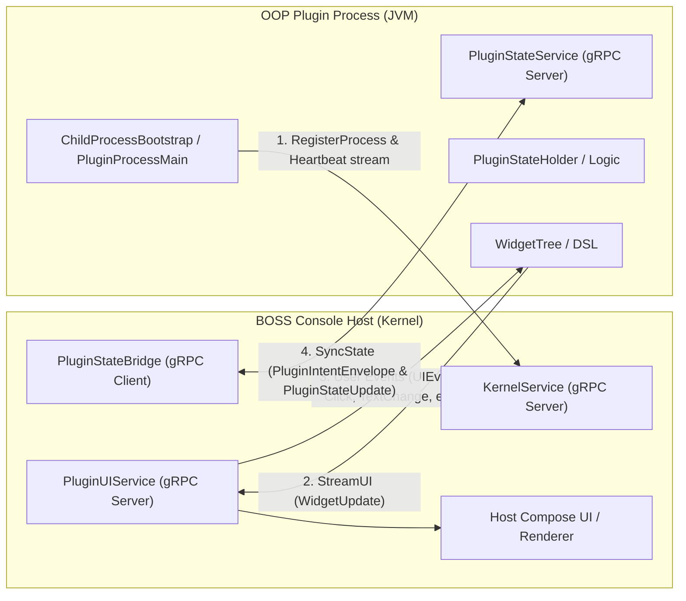
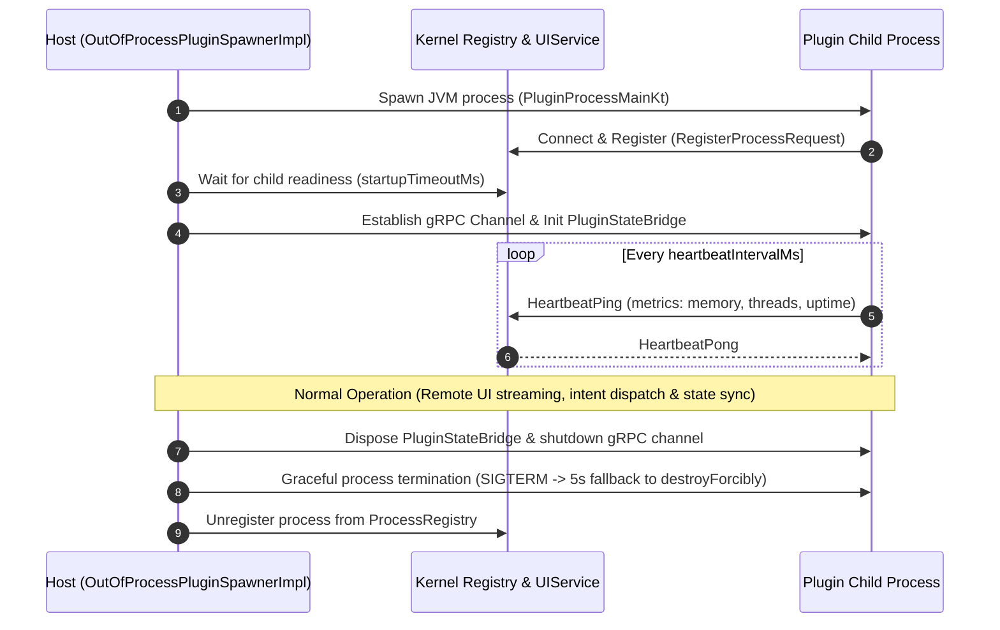

# Out-of-Process (OOP) Plugin & IPC Architecture Guide

This guide introduces the architecture, lifecycle, and IPC protocols for **Out-of-Process (OOP)** plugins within BOSS Console.

> Review status: the build, manifest and standalone-launch recipes below still need an executable integration fixture. The widget example is a local model only, not a complete loadable plugin. Do not treat this draft as a validated step-by-step setup guide.

---

## 1. Overview & Architectural Motivation

BOSS Console supports two execution models for plugins:

| Feature | In-Process Plugins | Out-of-Process (OOP) Plugins |
|---|---|---|
| **Runtime Boundary** | Host JVM (classloader isolation) | Host registration/UI plus child JVM state |
| **Crash Resilience** | Crash / OOM can destabilize host | Child failures are contained; host-side plugin code can still fail |
| **UI Rendering** | Direct Compose Multiplatform composables | Host Compose UI with child state (split-brain), or explicitly registered remote widget surfaces |
| **Classpath Separation** | Potential dependency conflicts with host | Separate child classpath/JVM arguments, plus host-loaded plugin classes |
| **Security / Sandbox** | Shares host memory address space | Separate address space; same OS user, with service-specific IPC checks |

The current `DynamicPluginManager` loads and registers the plugin in the host even on its OOP branch, then starts the child for state management. Declaring OOP therefore does not mean no plugin code executes in the host. Remote widget surfaces are a separate explicit registration path. When no spawner is available, the manager falls back to in-process loading; this is not controlled by the sample manifest's `fallback` key.

### Microkernel Host Components
- **`boss-ipc`**: Core Protocol Buffer definitions (`boss.ipc.v1`) and gRPC channel abstraction layer.
- **`boss-process-manager`**: Manages process lifecycle (`ProcessSpawner`, `ProcessRegistry`, restart policies).
- **`boss-orchestrator`**: Orchestrates service discovery, capability routing, and IPC event dispatching.
- **`boss-ui-sdk`**: Provides the remote widget tree declarative DSL, diff engine (`WidgetDiffEngine`), proto converters, and event mappings for headless child processes.
- **`OutOfProcessPluginSpawnerImpl`**: Host-side component responsible for launching, monitoring, handshaking, and tearing down plugin child processes.
- **`PluginUIServiceBridge`**: Kernel-side service implementing `PluginUIService` that receives streamed virtual widget trees and routes Compose user interactions back to child processes.
- **`boss-microkernel-runtime`**: Upstream standalone runtime JAR containing plugin state runners and dispatchers.

---

## 2. IPC Protocol & Communication Model

OOP plugins communicate with the BOSS Console host over local gRPC transport using Protocol Buffers defined in `:boss-ipc` under `boss.ipc.v1`.



### Core IPC Services (`boss.ipc.v1`)

1. **`KernelService` (`kernel.proto`)** *(Hosted by Kernel)*:
   - Process registration handshake (`RegisterProcessRequest` / `RegisterProcessResponse`).
   - Liveness heartbeat polling stream (`HeartbeatPing` / `HeartbeatPong`).
   - Service address directory discovery.

2. **`PluginUIService` (`ui_protocol.proto`)** *(Hosted by Kernel)*:
   - The plugin process acts as the gRPC **client**, dialing the Kernel's `PluginUIService`.
   - Plugin calls `RegisterUI` with initial `WidgetTree` layout and metadata.
   - Plugin opens bidirectional `StreamUI` call: streams `WidgetUpdate` (full tree or incremental `WidgetPatch`) to Kernel, and reads incoming `UIEvent` (clicks, text input, checkbox toggles, keystrokes) streamed from Kernel Compose UI.

3. **`PluginUIService` (`ui_protocol.proto`)**:
   - Streams virtual widget trees and incremental patches (`WidgetDiff`, `WidgetDiffEngine`).
   - Routes user interactions (clicks, text input, scroll events) back to the plugin process.

4. **`EventBusService` (`event_bus.proto`)**:
   - Enables publish-subscribe messaging across plugins and host subsystems.

### Versioning & Compatibility Handshake
The host checks the runtime manifest through `IpcVersion`: incompatible major versions and a minimum newer than the host are rejected. A blank minimum is accepted with a legacy warning; a manifest read failure is logged and currently does not prevent spawning. When spawning a plugin process:
- Host verifies `minIpcVersion` declared by the runtime JAR.
- Incompatible runtime JARs are rejected before process startup to prevent runtime serialization mismatches.

---

## 3. Plugin Lifecycle & Host Interaction



### Lifecycle Stages
1. **Spawn**: `OutOfProcessPluginSpawnerImpl.spawn()` builds the classpath (`runtimeClasspath` + `pluginJar` + `apiJar`), prepares the `ProcessConfig`, and executes the child process via `ProcessSpawner`.
2. **Registration Handshake**: The child connects back to the kernel via `BOSS_KERNEL_IPC_ADDR` and registers its process ID and IPC listening address.
3. **Readiness Gate**: Host awaits child registration up to `startupTimeoutMs` (default: 30s). If timeout expires, `cleanupFailedSpawn` forcibly kills the orphaned child. Registration occurs before runtime state-holder initialization, so it is not proof that state sync or UI is usable. The manager launches spawning in the background and logs a failure while the plugin can remain `LOADED`. Current dev scopes process IDs by window and uses the process ID as the state instance ID; plugin identity remains separate.
4. **Heartbeat & Monitoring**: The host config defaults `heartbeatIntervalMs` to 5s. Plugin children are excluded from the global health supervisor, so `RestartPolicy.ON_FAILURE` and `maxRestartAttempts` do not imply automatic plugin restart. See `KernelBootstrap` and the plugin-specific monitoring/recovery path. The standalone runtime currently advertises its own fixed 5s heartbeat and 30s startup contract.
5. **Teardown**: Host shuts down gRPC channels gracefully (with 3-second fallback to `shutdownNow`), disposes state bridges, and terminates the child process.

---

## 4. Building an OOP Plugin (Step-by-Step)

### Step 1: Plugin Manifest (`plugin.json`)

Declare `"isolationMode": "out-of-process"` in your plugin's `plugin.json`:

```json
{
  "manifestVersion": 1,
  "pluginId": "sample-oop-plugin",
  "displayName": "Sample OOP Plugin",
  "version": "1.0.0",
  "apiVersion": "1.0.0",
  "mainClass": "ai.rever.boss.plugin.sample.SamplePlugin",
  "type": "panel",
  "description": "Demonstrates out-of-process plugin capabilities",

  "isolationMode": "out-of-process",
  "fallback": "in-process",
  "stateHolderClass": "ai.rever.boss.plugin.sample.SampleStateHolder",

  "sandbox": {
    "maxThreads": 4,
    "maxRestartAttempts": 3,
    "heartbeatIntervalMs": 5000
  },

  "healthContract": {
    "heartbeatIntervalMs": 5000,
    "startupTimeoutMs": 30000
  },

  "panel": {
    "defaultSlot": "left.top.bottom",
    "iconName": "extension"
  },

  "isDynamic": true,
  "canUnload": true,
  "loadPriority": 100
}
```

### Step 2: Build Configuration (`build.gradle.kts`)

The packaging sketch below is not currently runnable: `boss-microkernel-runtime` is a standalone repository, not a BossConsole Gradle subproject. A complete recipe must resolve matching runtime and contract artifacts and package the plugin manifest at `META-INF/boss-plugin/plugin.json`. Keep the API version aligned with the host pin in `gradle/libs.versions.toml`; do not substitute an old API JAR. The child classpath is runtime JAR, plugin JAR, then the resolved API JAR.

```kotlin
plugins {
    alias(libs.plugins.kotlinJvm)
    alias(libs.plugins.kotlinSerialization)
    id("com.github.johnrengelman.shadow") version "8.1.1"
}

group = "ai.rever.boss.plugin.sample"
version = "1.0.0"

java {
    toolchain {
        languageVersion.set(JavaLanguageVersion.of(17))
    }
}

dependencies {
    // Plugin API and IPC definitions (provided at runtime by host - do not bundle)
    compileOnly(project(":plugin-platform:plugin-api-core"))
    compileOnly(project(":boss-microkernel-runtime"))
    compileOnly(project(":boss-ui-sdk"))
    compileOnly(project(":boss-ipc"))

    // Plugin-specific dependencies
    implementation(libs.kotlinx.coroutines.core)
    implementation(libs.kotlinx.serialization.json)
}

tasks.shadowJar {
    archiveClassifier.set("all")
    mergeServiceFiles()

    manifest {
        attributes["Main-Class"] = "ai.rever.boss.plugin.runtime.PluginProcessMainKt"
    }

    // Exclude API and host runtime modules already provided by the host environment
    dependencies {
        exclude(dependency("ai.rever.boss.plugin:plugin-api-core"))
        exclude(dependency("ai.rever.boss:boss-ipc"))
        exclude(dependency("ai.rever.boss:boss-ui-sdk"))
        exclude(dependency("ai.rever.boss.microkernel.runtime:boss-microkernel-runtime"))
    }
}
```

> **Note on Gradle Module Paths**: When building inside the BOSS Console repository, microkernel modules live in `modules/` but use flat Gradle project paths: `:boss-ipc` and `:boss-ui-sdk` (not `:modules:boss-ipc`).

### Step 3: Implementing State & Remote UI (`boss-ui-sdk`)

The following is a pure widget-model example using the actual `boss-ui-sdk` API, not a loadable runtime state holder. It does not satisfy `stateHolderClass`: the runtime requires a `CoroutineScope` constructor (optionally also `RemotePluginContext`) and only wires state sync for a `PluginStateHolder` subclass. A complete integration must also supply serialization/intent handling and explicit surface registration.

```kotlin
package ai.rever.boss.plugin.sample

import ai.rever.boss.ui.sdk.WidgetTree
import ai.rever.boss.ui.sdk.widgetTree
import ai.rever.boss.ui.sdk.WidgetEvent
import ai.rever.boss.ui.sdk.WidgetTree
import ai.rever.boss.ui.sdk.widgetTree
import kotlinx.coroutines.flow.MutableStateFlow
import kotlinx.coroutines.flow.StateFlow
import kotlinx.coroutines.flow.asStateFlow
import kotlinx.serialization.Serializable

@Serializable
data class SampleUiState(
    val counter: Int = 0,
    val statusText: String = "Ready"
)

class SampleStateHolder {
    private val _state = MutableStateFlow(SampleUiState())
    val state: StateFlow<SampleUiState> = _state.asStateFlow()

    fun increment() {
        val current = _state.value
        _state.value = current.copy(
            counter = current.counter + 1,
            statusText = "Incremented at ${System.currentTimeMillis()}"
        )
    }

    fun handleEvent(event: WidgetEvent) {
        if (event is WidgetEvent.Click && event.eventId == "btn_increment") {
            increment()
        }
    }

    fun renderUI(): WidgetTree = widgetTree {
        column {
            text("Counter: ${_counter.value}")
            button(label = "Increment Counter", onClickEvent = "btn_increment")
        }
    }
}
```

`WidgetDiffEngine.diff` computes local `DiffOperation` values; it does not transmit them. Plugin code must register a surface through the runtime client, convert the tree or diff to protobuf, send updates, collect UI events, and dispose the surface. `PluginUIService` is served by the host; the child calls `RegisterUI` and then `StreamUI`, sending `WidgetUpdate` values and receiving `UIEvent` values on that stream. Reconnection requires registration again. Key events additionally require the surface registration to opt into `wants_keys`.

---

## 5. Security & Permission Boundaries

1. **Process Isolation**: A separate JVM contains many child failures, but is not an operating-system security sandbox. It runs as the same OS user and can access resources permitted to that user; resource exhaustion can still affect the host.
2. **IPC Identity and Authorization**: Kernel calls can carry a verified process identity via `ProcessIdentityInterceptor`. Remote UI checks ownership against that identity. This is not a blanket RBAC guarantee for every service: inspect the individual service bridge and provider before relying on an authorization boundary. Child-side servers do not automatically inherit the kernel interceptor.
3. **Environment Inheritance**: `ProcessSpawner` starts with the inherited `ProcessBuilder` environment and adds process addresses, identity, and a minted `BOSS_PROCESS_TOKEN`, plus plugin/window/project values. It does not clear or allowlist the parent environment. Never assume secrets in the host environment are hidden from a child.

---

## 6. Debugging & Local Testing

### Standalone Process Execution
The command below is incomplete and must not be used as a standalone setup recipe. `ChildProcessBootstrap` also requires process identity and a child address (or the process type from which to resolve it), and authenticated remote UI needs a host-minted process token. `PluginProcessMain` requires `BOSS_PLUGIN_CLASSPATH`. A future fixture should supply these through a test host; do not copy or log credentials from a running host. Classpath separators are `:` on macOS/Linux and `;` on Windows.

Original sketch awaiting that fixture:
1. Launch BOSS Console with debug logging enabled (`-Dlogback.configurationFile=logback-debug.xml`).
2. Run the plugin process with standard JVM debugging arguments:
   ```bash
   java -agentlib:jdwp=transport=dt_socket,server=y,suspend=n,address=5005 \
        -cp "runtime.jar;plugin.jar" \
        ai.rever.boss.plugin.runtime.PluginProcessMainKt
   ```
3. Pass `BOSS_KERNEL_IPC_ADDR=localhost:<port>` and `BOSS_PLUGIN_ID=<id>` as environment variables.

Use `WidgetDiffEngine` directly in unit tests to assert UI tree generation and diff delta calculations without spinning up a gRPC server:

```kotlin
@Test
fun testWidgetTreeGeneration() {
    val stateHolder = SampleStateHolder()
    val initialTree = stateHolder.renderUI()

    stateHolder.increment()
    val updatedTree = stateHolder.renderUI()

    val patches = WidgetDiffEngine.diff(initialTree, updatedTree)
    assertTrue(patches.isNotEmpty())
}
```

## Source references

- [Host OOP load path](../composeApp/src/commonMain/kotlin/ai/rever/boss/components/plugin/DynamicPluginManager.kt)
- [Child spawner and readiness](../composeApp/src/desktopMain/kotlin/ai/rever/boss/components/plugin/OutOfProcessPluginSpawnerImpl.kt)
- [Process supervision](../modules/boss-process-manager/src/main/kotlin/ai/rever/boss/process/ProcessMonitor.kt)
- [UI wire contract](../modules/boss-ipc/src/main/proto/boss/ipc/v1/ui_protocol.proto)
- [Identity interceptor](../modules/boss-ipc/src/main/kotlin/ai/rever/boss/ipc/auth/ProcessIdentityInterceptor.kt)
- [SDK builder](../modules/boss-ui-sdk/src/main/kotlin/ai/rever/boss/ui/sdk/WidgetTreeBuilder.kt) and [diff engine](../modules/boss-ui-sdk/src/main/kotlin/ai/rever/boss/ui/sdk/WidgetDiffEngine.kt)
- [Standalone runtime entry point, reviewed revision](https://github.com/risa-labs-inc/boss-microkernel-runtime/blob/7ac0607ee7884b04a4b225bbdc3cf732c83cb30f/src/main/kotlin/ai/rever/boss/plugin/runtime/PluginProcessMain.kt)
